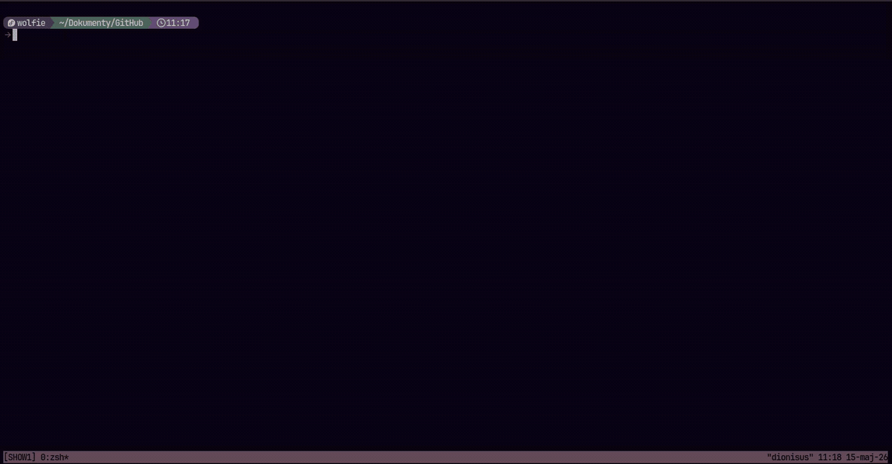

# tmux-jot

`tmux-jot` is a tmux popup note manager (sticky notes). It keeps notes on disk, links one active note to each tmux session, and opens notes in a hidden tmux session so the editor state survives popup close/open cycles.

<p align="center">
  <a href="assets/showcase.mp4">
    
  </a>
</p>

## Requirements

- tmux with `display-popup` support
- `fzf`
- `rg` / ripgrep for content search
- an editor command, default: `nvim`

## Installation

### TPM

Set options before the TPM plugin declaration, then add the plugin:

```tmux
set -g @jot-dir "~/.local/share/tmux-jot"
set -g @jot-editor "nvim"

set -g @plugin 'szymonwilczek/tmux-jot'
```

Reload tmux and install with TPM:

```tmux
prefix + I
```

### Manual

Clone the repository and load the plugin from `~/.tmux.conf`:

```sh
git clone https://github.com/szymonwilczek/tmux-jot ~/.tmux/plugins/tmux-jot
```

```tmux
run-shell "~/.tmux/plugins/tmux-jot/tmux-jot.tmux"
```

Set options before `run-shell` if you configure the plugin manually.

## Usage

| Action | Default binding | Description |
|---|---:|---|
| Toggle session note | `prefix + j` | Opens the note linked to the current tmux session. If no note is linked, opens the note picker. If a popup is already open for the client, closes it. |
| Switch note / picker | `prefix + M-j` | Opens the note picker. Selecting an existing note links it to the current session. Entering a new name creates a note. |
| Search note content | `prefix + M-w` | Opens an `fzf` content search powered by ripgrep. Selecting a match links and opens the matching note. |
| Doctor | `prefix + M-i` | Shows context, command availability, paths, config, hidden sessions, and popup state. |
| Cleanup | `prefix + M-k` | Kills detached hidden editor sessions whose names match the hidden session prefix. |
| Increase popup size | `prefix + M-=` or `prefix + M-+` | Increases popup width and height by 5 percentage points or cells, depending on configured size units. |
| Decrease popup size | `prefix + M--` or `prefix + M-_` | Decreases popup width and height by 5 percentage points or cells, depending on configured size units. |
| Repeat resize | `M-=`, `M-+`, `M--`, `M-_` | Works for `@jot-resize-repeat-time` seconds after a resize command while a tmux-jot popup is open. |
| Reset popup size | `prefix + M-r` | Resets the current session popup size delta to `0`. |

`M-` means tmux Meta/Alt notation. Bind values are passed directly to `tmux bind-key`, so they may include flags such as `-n` or `-r`.

## Storage Model

Notes are regular files:

```text
@jot-dir/<note-name>.<extension>
```

The current note for each tmux session is stored as a symlink:

```text
@jot-session-dir/<safe-session-name>.<extension>
```

If `@jot-session-dir` is unset, session links are stored in:

```text
@jot-dir/.sessions
```

Editor popups are backed by hidden tmux sessions named from `@jot-hidden-session-prefix` and the safe note name. This keeps the editor process alive between popup open/close cycles.

> Note names may not be empty and may not contain `/`, newline, or carriage return.

## Configuration

Set tmux options before loading the plugin.

With TPM, options must be set before `set -g @plugin 'szymonwilczek/tmux-jot'`.

```tmux
set -g @jot-dir "~/.local/share/tmux-jot"
set -g @jot-editor "nvim"
set -g @plugin 'szymonwilczek/tmux-jot'
```

With manual installation, options must be set before `run-shell`.

```tmux
set -g @jot-dir "~/.local/share/tmux-jot"
set -g @jot-editor "nvim"
run-shell "~/.tmux/plugins/tmux-jot/tmux-jot.tmux"
```

Use an empty string, `off`, `none`, or `disabled` to disable a binding.

| Option | Default | Description | Example |
|---|---:|---|---|
| `@jot-key-bind` | `j` | Main toggle binding in the prefix table. Opens the linked session note or the picker. | `set -g @jot-key-bind "N"` |
| `@jot-switch-key-bind` | `M-j` | Opens the note picker. | `set -g @jot-switch-key-bind "M-n"` |
| `@jot-content-search-key-bind` | `M-w` | Opens content search. | `set -g @jot-content-search-key-bind "M-s"` |
| `@jot-doctor-key-bind` | `M-i` | Opens the doctor report. | `set -g @jot-doctor-key-bind "M-d"` |
| `@jot-cleanup-key-bind` | `M-k` | Opens cleanup report and kills detached hidden sessions. | `set -g @jot-cleanup-key-bind "M-c"` |
| `@jot-resize-increase-key-bind` | `-r M-=` | Prefix-table binding for increasing popup size. | `set -g @jot-resize-increase-key-bind "-r M-="` |
| `@jot-resize-increase-shift-key-bind` | `-r M-+` | Prefix-table shifted variant for increasing popup size. | `set -g @jot-resize-increase-shift-key-bind "-r M-+"` |
| `@jot-resize-increase-repeat-key-bind` | empty | Optional prefix-table repeat binding for increasing popup size. Disabled by default to avoid conflicts with plain `+` or `=`. | `set -g @jot-resize-increase-repeat-key-bind "-r ="` |
| `@jot-resize-increase-repeat-shift-key-bind` | empty | Optional prefix-table shifted repeat binding for increasing popup size. Disabled by default. | `set -g @jot-resize-increase-repeat-shift-key-bind "-r +"` |
| `@jot-resize-decrease-key-bind` | `-r M--` | Prefix-table binding for decreasing popup size. | `set -g @jot-resize-decrease-key-bind "-r M--"` |
| `@jot-resize-decrease-shift-key-bind` | `-r M-_` | Prefix-table shifted variant for decreasing popup size. | `set -g @jot-resize-decrease-shift-key-bind "-r M-_"` |
| `@jot-resize-decrease-repeat-key-bind` | empty | Optional prefix-table repeat binding for decreasing popup size. Disabled by default to avoid conflicts with plain `-`. | `set -g @jot-resize-decrease-repeat-key-bind "-r -"` |
| `@jot-resize-decrease-repeat-shift-key-bind` | empty | Optional prefix-table shifted repeat binding for decreasing popup size. Disabled by default. | `set -g @jot-resize-decrease-repeat-shift-key-bind "-r _"` |
| `@jot-resize-increase-root-repeat-key-bind` | `-n M-=` | Root-table repeat binding used only while tmux-jot resize repeat mode is active. Outside repeat mode, the literal key is sent through. | `set -g @jot-resize-increase-root-repeat-key-bind "-n M-="` |
| `@jot-resize-increase-root-repeat-shift-key-bind` | `-n M-+` | Root-table shifted repeat binding for increasing popup size. | `set -g @jot-resize-increase-root-repeat-shift-key-bind "-n M-+"` |
| `@jot-resize-decrease-root-repeat-key-bind` | `-n M--` | Root-table repeat binding used only while tmux-jot resize repeat mode is active. | `set -g @jot-resize-decrease-root-repeat-key-bind "-n M--"` |
| `@jot-resize-decrease-root-repeat-shift-key-bind` | `-n M-_` | Root-table shifted repeat binding for decreasing popup size. | `set -g @jot-resize-decrease-root-repeat-shift-key-bind "-n M-_"` |
| `@jot-resize-repeat-time` | `2` | Seconds after a resize command during which root repeat resize bindings are active. | `set -g @jot-resize-repeat-time "3"` |
| `@jot-resize-reset-key-bind` | `M-r` | Resets the current session popup size delta. | `set -g @jot-resize-reset-key-bind "M-0"` |
| `@jot-hidden-session-prefix` | `__tmux__jot_` | Prefix used for hidden editor sessions. | `set -g @jot-hidden-session-prefix "__jot_"` |
| `@jot-debug` | `off` | Enables debug logging. Truthy values: `1`, `on`, `true`, `yes`, `y`. | `set -g @jot-debug "on"` |
| `@jot-icons` | `on` | Enables built-in icons in title and prompt templates. Set to `off` to disable them. | `set -g @jot-icons "off"` |
| `@jot-log-file` | `~/.local/state/tmux-jot.log` | Debug log path. Used only when debug is enabled. | `set -g @jot-log-file "~/.cache/tmux-jot.log"` |
| `@jot-dir` | `~/.local/share/tmux-jot` | Directory containing note files. | `set -g @jot-dir "~/notes/tmux"` |
| `@jot-extension` | `md` | Note file extension. Leading dots are removed; slashes are replaced with `_`. The plugin does not validate file format; any extension can be used. | `set -g @jot-extension "txt"` |
| `@jot-session-dir` | empty | Directory containing per-session symlinks. Empty means `@jot-dir/.sessions`. | `set -g @jot-session-dir "~/.local/state/tmux-jot/sessions"` |
| `@jot-editor` | `$EDITOR` or `nvim` | Editor command used in hidden editor sessions. Any command that can open a file path is supported. | `set -g @jot-editor "vim"` |
| `@jot-shell` | `/bin/bash` | Shell used to run `fzf` commands. | `set -g @jot-shell "/usr/bin/bash"` |
| `@jot-fzf-command` | `fzf` | `fzf` executable or command. | `set -g @jot-fzf-command "fzf-tmux"` |
| `@jot-fzf-options` | empty | Extra options appended to all `fzf` invocations. | `set -g @jot-fzf-options "--height=100%"` |
| `@jot-sort-notes` | `off` | Sorts picker note list when truthy. | `set -g @jot-sort-notes "on"` |
| `@jot-rg-command` | `rg` | Ripgrep command used for content search. | `set -g @jot-rg-command "rg --hidden"` |
| `@jot-content-search-prompt` | `{icon} Search content: ` | Prompt template for content search. Supports `{icon}`, `{session}`, `{note}`, `{file}`. Uses the built-in search icon when `@jot-icons` is `on`. | `set -g @jot-content-search-prompt "{icon} Search: "` |
| `@jot-content-search-preview-window` | `right,60%,border-left` | `fzf --preview-window` value for content search. | `set -g @jot-content-search-preview-window "down,50%,border-top"` |
| `@jot-border-color` | `#b38d59` | Popup border foreground color. | `set -g @jot-border-color "cyan"` |
| `@jot-border-style` | `rounded` | Popup border line style passed to `display-popup -b`. | `set -g @jot-border-style "single"` |
| `@jot-popup-width` | `40%` | Base popup width. Percentages and integer cell values are supported. | `set -g @jot-popup-width "80"` |
| `@jot-popup-height` | `50%` | Base popup height. Percentages and integer cell values are supported. | `set -g @jot-popup-height "70%"` |
| `@jot-popup-x` | `R` | Popup horizontal anchor. `R` means right aligned, `C` means centered, percentages are relative to available space, integers are absolute cells. | `set -g @jot-popup-x "C"` |
| `@jot-popup-y` | `0` | Popup vertical anchor. `C` means centered, percentages are relative to available space, integers are absolute cells. | `set -g @jot-popup-y "2"` |
| `@jot-title-icon` | `📌` | Icon used by the popup title template when `@jot-icons` is `on`. | `set -g @jot-title-icon "J"` |
| `@jot-title` | ` {icon} {note} ` | Popup title template. Supports `{icon}`, `{session}`, `{note}`, `{file}`. | `set -g @jot-title " {session}: {note} "` |
| `@jot-fzf-prompt` | `{icon} Select / Create: ` | Picker prompt template. Supports `{icon}`, `{session}`, `{note}`, `{file}`. Uses the built-in note icon when `@jot-icons` is `on`. | `set -g @jot-fzf-prompt "{icon} Note: "` |

## Resize Behavior

Base size comes from `@jot-popup-width` and `@jot-popup-height`. Each resize changes a per-session delta by 5.

For percentage sizes, the result is clamped to `20%..100%`. For integer cell sizes, the result is clamped to `10..client-size`.

The reset binding clears only the current tmux session's delta.

## Content Search

Content search uses ripgrep with:

- `--line-number`
- `--column`
- `--no-heading`
- `--smart-case`
- `--glob "*.<extension>"`

The `fzf` search view is disabled by default and reloads ripgrep results on query changes.

## Troubleshooting

Run doctor:

```tmux
prefix + M-i
```

Enable debug logging:

```tmux
set -g @jot-debug "on"
set -g @jot-log-file "~/.local/state/tmux-jot.log"
```

Cleanup detached hidden sessions:

```tmux
prefix + M-k
```

If a binding was previously registered in the root table, explicitly unbind it before loading the plugin:

```tmux
unbind-key -n j
```

## Internal tmux Options

The plugin stores runtime state in tmux options. These are not intended as user configuration:

| Option pattern | Purpose |
|---|---|
| `@jot-size-delta` | Per-session resize delta. |
| `@jot_popup_*` | Active popup state per client. |
| `@jot_origin_*` | Source session tracking per client. |
| `@jot_resize_repeat_*` | Resize repeat timeout per client. |
| `@jot-source-client` | Hidden session source client. |
| `@jot-origin-session` | Hidden session origin session. |

## License

tmux-jot is licensed under the GNU General Public License v3.0. See [LICENSE](LICENSE).
